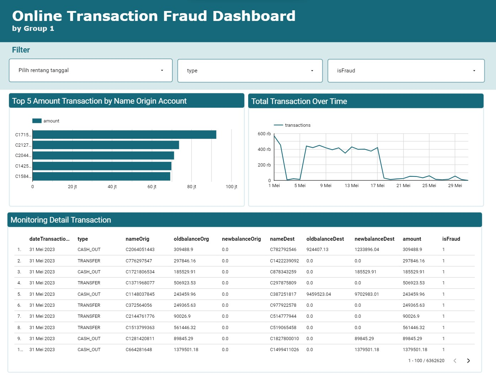

# Final Project: Fraud Transaction Pipeline

## Data
You can download the dataset [here](https://drive.google.com/file/d/1LmPGE7Vgn1yYszM0s9nwfmwr36RHI3BB/view?usp=drive_link)

## Bussiness Understanding
### Problem Description
A Digital Wallet company has quite a large amount of online transaction data. The company wants to acknowledging data limitation and uncertainties such as inaccurate or missing crucial information data. On the other hand, the company also wants to use online transaction data to detect online payment fraud that harms their business.

### Goals
Create a data pipeline that can be utilised for analysis and reporting to determine whether online transaction data has excellent data quality and can be used to detect fraud in online transactions. 

### Project Objectives
- Create an **automated pipeline** that facilitates the batch and stream data processing from various data sources to data warehouses and data mart.
- Create a **visualization dashboard** to obtain meaningful insights from the data, enabling informed business decisions.

## Pipeline Architecture


Image 1. Pipeline Architecture


## Tools
- Orchestration: Airflow
- Tranformation: Spark, dbt 
- Streaming: Kafka
- Container: Docker
- Storage: Google Cloud Storage
- Warehouse: BigQuery
- Data Visualization: Looker

## Project Structur
```bash
final-project-fraud-transaction-pipeline/
|-- dags
|   |-- batch_dag.py
|   |-- download.sh
|-- datasets
|-- dbt
|-- kafka
|-- logs
|-- service-account
|   |-- service-account.json
|-- spark
|-- terraform
```
- dags, this folder that runs the batch processing fraud transaction pipeline.
- datasets, This folder is for storing downloaded datasets.
- dbt, this folder for runs transformation with dbt.
- kafka, this folder for runs the stream processing fraud transaction pipeline.
- service-account, this folder is for storing the json file of the service account
- spark, this folder for runs transformation with spark
- terraform, idk more

## What should you install on your desktop ?

Docker Engine & Docker Compose : https://docs.docker.com/engine/install/ 

## Cloud Environment Configuration
This project uses Google Cloud Platform (GCP) with Google Cloud Storage as the cloud environment for data storage and Google Bigquery as the cloud environment for data warehouse.
### Prerequisites
1. Create a GCP Account: To use GCP services, you need a GCP account. If you don't have one, sign up at https://cloud.google.com/free to create a free account.
2. Set Up a Project: Create a new GCP project in the GCP Console: https://console.cloud.google.com/projectcreate
3. Enable Billing: Make sure your GCP project has billing enabled, as some services like BigQuery may not work without billing enabled.
4. Create a Service Account: In the GCP Console, go to "IAM & Admin" > "Service Accounts" and create a new service account. Download the service account key as a JSON file and save it securely on your local machine.
5. Grant Permissions: Assign the service account the necessary permissions to access BigQuery datasets and Google data storage.

## Project Instruction
##### Clone this repository and enter the directory
```
git clone https://github.com/graceyudhaaa/final-project-fraud-transaction-pipeline.git && cd final-project-fraud-transaction-pipeline
```
Create a folder named `service-account` Create a GCP project. Then, create a service account with Editor role. Download the JSON credential rename it to `service-account.json` and store it on the `service-account` folder.

##### Cloud Resource Provisioning with Terraform
1. Install [Terraform CLI](https://developer.hashicorp.com/terraform/downloads?product_intent=terraform)
1. Change directory to terraform by executing
    ```
    cd terraform
    ```
1. Initialize Terraform (set up environment and install Google provider)
    ```
    terraform init
    ```
1. Create new infrastructure by applying Terraform plan
    ```
    terraform apply
    ```
1. Check your GCP project for newly created resources (GCS Bucket and BigQuery Datasets)

##### Manually Create Resources
Alternatively you can create the resources manually:
1. Create a GCS bucket named `final-project-lake`, set the region to `asia-southeast2`
1. Create two datasets in BigQuery named `onlinetransaction_wh` and `onlinetransaction_stream`

## Batch Processing

##### move the service account that was downloaded earlier into ./final-project-fraud-transaction-pipeline/service-account and rename it with service-account.json

##### Enter the directory project

```bash
cd final-project-fraud-transaction-pipeline
```

##### 

##### Run your docker Engine & docker compose

##### Create image and build environment with Docker Compose
```bash
docker-compose up
```
#### Open Airflow with username and password "airflow" to run the DAG
```
localhost:8080
```


#### Open Spark to monitor Spark master and Spark workers
```
localhost:8081
```


## Streaming Processing

##### Enter the directory streaming pipeline
```bash
cd kafka
```

##### Create streaming pipeline with Docker Compose
```bash
docker-compose up
```

##### Install required Python packages
```bash
pip install -r requirements.txt
```

##### Setup Email for Notification
1. Copy the `env.example` file, rename it to `.env`
1. Fill the required information for the sender and receiver email


##### Run the producer to stream the data into the Kafka topic
```bash
python producer.py
```

##### Run the consumer to consume the data from Kafka topic and load them into BigQuery
```bash
python consumer.py
```
<br>

Data will be loaded into the record table for all transactions in BigQuery, and if any data is detected as fraud, it will be recorded in the detected_fraud table, and an automatic email notification indicating fraud will be sent.


Image 2. Streaming Process <br


Image 3. Fraud Detected Table <br>


Image 4. Email Notification from Data that Detected Fraud

##### DEBUGGING: Schema Registry Exited
If you run into a problem where, the schema registry image was exited. with the message
```
INFO io.confluent.admin.utils.ClusterStatus - Expected 1 brokers but found only 0. Trying to query Kafka for metadata again
```

You might want to reset your firewall with running this on your command line with administrator permission
```
iisreset
```


## Data Warehouse
In this project, we use star-schema to define the data warehouse. In the warehouse there are several tables, namely: 
<br>
a. Dim Type 
<br>
b. Dim Origin 
<br>
c. Dim Dest 
<br>
d. Fact Transaction

Here is the data warehouse schema that we developed.

Image 5. Data Warehouse Schema

## Analytic and Visualization
The outcome of this comprehensive data pipeline project is a dashboard that allows someone get insight for fraudulent transaction.

Our dashboard through the following link:
[Online Transaction Fraud Dashboard](https://lookerstudio.google.com/reporting/eef88548-5ad4-4b22-82c4-37b7bb29ce0e)



Image 6. Dashboard Visualization
